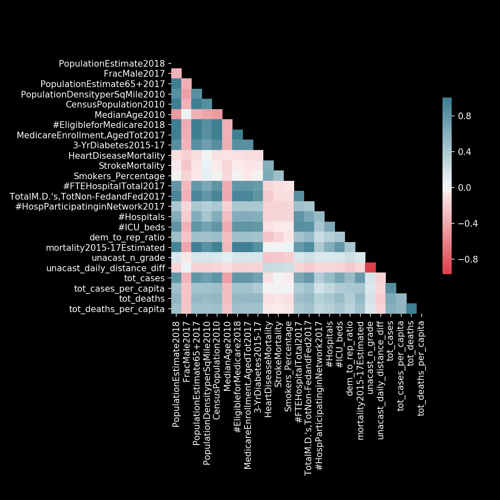

<iframe src="https://docs.google.com/presentation/d/e/2PACX-1vR0IZcUMdTrz6KIw9G1yuzcKHRDUJTS7rQvASzZLKUMi5VFrt18-HptCG6-627VM5McNNNjUirt9fb7/embed?start=false&loop=false&delayms=3000" frameborder="0" width="100%" height="600" allowfullscreen="true" mozallowfullscreen="true" webkitallowfullscreen="true"></iframe>

# Quickstart with the data + models

This section details how to quickly download and get started with the data + models.

## Data
1. download the processed data (as a pickled dataframe `df_county_level_cached.pkl`) from [this folder](https://drive.google.com/drive/u/2/folders/1OfeUn8RcOfkibgjtuuVt2z9ZtzC_4Eq5) and place into the `data` directory
2. Can now load/merge the data:
```python
import load_data
df = load_data.load_county_level(data_dir='/path/to/data')
print(df.shape) # (1212, 7306)
```
- note: (non-cumulative) daily cases + deaths are in `data/usafacts/confirmed_cases.csv` and `data/usafacts/deaths.csv` (updated daily)
- note: abridged csv with county-level info such as demographics, hospital information, risk factors, social distancing, and voting data is at `data/df_county_level_abridged_cached.csv`
- for more data details, see [./data/readme.md](./data/readme.md)
- for an intro to some of the analysis here, visit the [project webpage](https://yu-group.github.io/covid19-severity-prediction/)
- we are constantly monitoring for new data sources, and updating sources of data as they become available [here](https://docs.google.com/document/d/1Gxfp-8NXHZN1Hre0CThx0sdO17vDOso640eK6MHlbiU/)

## Prediction
- To get deaths predictions of the naive exponential growth model, the simplest way is to call (for more details, see [./modeling/readme.md](./modeling/readme.md))

```python
df = add_preds(df, NUM_DAYS_LIST=[1, 2, 3]) # adds keys like "Predicted Deaths 1-day"
# NUM_DAYS_LIST is number of days in the future to predict
```

## Related county-level projects
- [County-level data summaries from JHU](https://github.com/JieYingWu/COVID-19_US_County-level_Summaries)
- [More aggregated county-level data from Caltech](https://github.com/COVIDmodeling/covid_19_modeling)
- [UChicago GeoData visualization team](https://github.com/GeoDaCenter/covid)

    
# Overview

**Goal**: prioritizing where to send medical supplies (i.e. ventilators, masks, etc.), in collaboration with [response4life](https://response4life.org/)

1. **Approach** 
    - predict expected deaths/cases at the county-level
    - we use many features at the county-level, such as demographics, comorbidity statistics, voting data
    - estimate supplies/need based on available data (e.g. number of icu beds, personnel in hospital)
    - filter hospitals and score them according to their expected demand for additional supplies
    - we use simple models, some which are fit individually to each county, and some fit jointly to the entire country
2. **Data**
    - county-level: daily confirmed cases + deaths, demographics, comorbidity statistics, voting data, local gov. action data, population density, risk factors from medicare (e.g. diabetes, respiratory disease, other chronic conditions)
    - hospital-level: information about hospitals (e.g. number of icu beds, hospital type, location)    
    - limitations
        - currently using proxies for hospitals supplies/demands instead of real measurements
        - limited data on bridging county-level data with hospital-level data
        - missing some local data which would be helpful, such as amount of testing and social distancing measures   
3. **Results**
    - pretty decent predictions for number of deaths a few days in the future


# Visualizations

## Looking at some county-level statistics

Many of the county-level features we have collected are correlated with the total number of deaths recorded so far at each county (and with each other):


## Interactive visualizations of different counties

We can also plot the predicted number of deaths at the county-level:
<figure class="video_container">
  <iframe src="https://yu-group.github.io/covid19-severity-prediction/results/deaths.html" frameborder="0" allowfullscreen="true" width="140%" height="800"> </iframe>
</figure>

We can visualize these features on interactive maps:
<figure class="video_container">
  <iframe src="https://yu-group.github.io/covid19-severity-prediction/results/NY.html" frameborder="0" allowfullscreen="true" width="140%" height="800"> </iframe>
</figure>

We can plot the outbreak for the counties with the highest number of deaths so far (updated daily):
<figure class="video_container" style="text-align: center">
  <iframe src="https://yu-group.github.io/covid19-severity-prediction/results/county_curves.html" frameborder="0" allowfullscreen="true" width="140%" height="800"> </iframe>
</figure>


# Acknowledgements

The UC Berkeley Departments of Statistics, EECS and IEOR led by Professor Bin Yu

- **Yu Group team** (alphabetical order): Nick Altieri, Rebecca Barter, James Duncan, Raaz Dwivedi, Karl Kumbier, Xiao Li, Robbie Netzorg, Briton Park, Chandan Singh (student lead), Yan Shuo Tan, Tiffany Tang, Yu Wang
- Shen Group team (alphabetical order): Junyu Cao, Shunan Jiang, Pelagie Elimbi Moudio
- the response4Life team and volunteers
- Helpful input from many including (alphabetical order): SriSatish Ambati, Rob Crockett, Marty Elisco, David Jaffe, Aaron Kornblith, Samuel Scarpino, Suzanne Tamang, Tarek Zohdi
