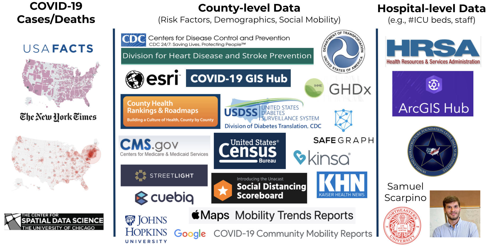

<h1 align="center">Covid Severity Forecasting</h1>

<p align="center">Data and models (updated daily) for forecasting COVID-19 severity for individual counties and hospitals in the US. The data includes confirmed cases/deaths, demographics, risk factors, social distancing data, and much more.
</p>

<p align="center">
  <a href="#overview">Overview</a> •
  <a href="#quickstart-with-the-data--models">Quickstart</a> •
  <a href="#acknowledgements">Acknowledgements</a> 
</p>

# Overview

*Note: This repo is actively maintained - for any questions, please file an issue.*

- **[Paper link](https://www.stat.berkeley.edu/~binyu/ps/papers2020/covid19_paper.pdf)**: "Curating a COVID-19 data repository and forecasting county-level death counts in the United States"
- **[Project website](http://covidseverity.com/)**: http://covidseverity.com/
    - see [interactive county-level map](http://covidseverity.com/results/deaths.html) + [interactive hospital-level map](http://covidseverity.com/results/severity_map.html)

- **[Data](./data/readme.md)** (updated daily): We have compiled, cleaned, and documented a large corpus of hospital- and county-level data from a variety of public sources to aid data science efforts to combat COVID-19.
    - At the hospital level, the data include the location of the hospital, the number of ICU beds, the total number of employees, the hospital type, and contact information
    - At the county level, our data include socioeconomic factors, social distancing scores, and COVID-19 cases/deaths from USA Facts and NYT
    - Easily downloadable as [processed csv](./data/county_data_abridged.csv) or full pipeline
    - Extensive documentation available [here](./data/list_of_columns.md)

- **[Modeling](./modeling/readme.md)**: Using this data, we have developed a short-term (3-5 days) forecasting model for mortality at the county level. This model combines a county-specific exponential growth model and a shared exponential growth model through a weighted average, where the weights depend on past prediction accuracy.

- **Severity index**: The Covid pandemic severity index (CPSI) is designed to help aid the distribution of medical resources to hospitals. It takes on three values (3: High, 2: Medium, 1: Low), indicating the severity of the covid-19 outbreak for a hospital on a certain day. It is calculated in three steps.
    1. county-level predictions for number of deaths are modeled
    2. county-level predictions are allocated to hospitals within counties proportional the their total number of employees
    3. final value is decided by thresholding the number of cumulative predicted deaths for a hospital (=current recorded deaths + predicted future deaths)


# Quickstart with the data + models

Can download, load, and merge the data via:
```python
import load_data
# first time it runs, downloads and caches the data
df = load_data.load_county_level(data_dir='/path/to/data') 
```

- for more data details, see [./data/readme.md](./data/readme.md)
- see also the [county_quickstart notebook](county_quickstart.ipynb)
- we are constantly monitoring and adding new data sources (+ relevant data news [here](https://docs.google.com/document/d/1Gxfp-8NXHZN1Hre0CThx0sdO17vDOso640eK6MHlbiU/))
- output from running the daily updates is stored [here](./functions/update_test.log)

To get deaths predictions for our current best-performing model, the simplest way is to call (for more details, see [./modeling/readme.md](./modeling/readme.md))

```python
from modeling.fit_and_predict import add_preds
df = add_preds(df, NUM_DAYS_LIST=[1, 3, 5]) # adds keys like "Predicted Deaths 1-day", "Predicted Deaths 3-day"
# NUM_DAYS_LIST is list of number of days in the future to predict
```

## Related county-level projects
- [County-level data summaries from JHU](https://github.com/JieYingWu/COVID-19_US_County-level_Summaries)
- [UChicago GeoData visualization team](https://geodacenter.github.io/covid/about)


# Acknowledgements

The UC Berkeley Departments of Statistics, EECS led by Professor Bin Yu (group members are all alphabetical by last name)

- **[Yu group team](https://www.stat.berkeley.edu/~yugroup/people.html)** (Data/modeling): Nick Altieri, Rebecca Barter, James Duncan, Raaz Dwivedi, Karl Kumbier, Xiao Li, Robbie Netzorg, Briton Park, Chandan Singh (student lead), Yan Shuo Tan, Tiffany Tang, Yu Wang
- [response4Life](https://response4life.org/) team and volunteers (Organization/distribution)
- [Kolak group team](https://geodacenter.github.io/covid/about) (Geospatial visualization): Qinyun Lin
- [Medical team](https://emergency.ucsf.edu/people/aaron-kornblith-md) (Advice from a medical perspective): Roger Chaufournier, Aaron Kornblith, David Jaffe
- [Shen Group team](https://shen.ieor.berkeley.edu/) (IEOR): Junyu Cao, Shunan Jiang, Pelagie Elimbi Moudio
- Helpful input from many including: SriSatish Ambati, Rob Crockett, Tina Elassia-Rad, Marty Elisco, Nick Jewell, Valerie Isham, Valerie Karplus, Andreas Lange, Ying Lu, Samuel Scarpino, Jas Sekhon, Phillip Stark, Jacob Steinhardt, Suzanne Tamang, Brian Yandell, Tarek Zohdi
- Additionally, we would like to thank our sources, which can be found in the [data readme](./data/readme.md)

To reference, please cite [the paper](https://www.stat.berkeley.edu/~binyu/ps/papers2020/covid19_paper.pdf) 
```c
@article{altieri2020curating,
  title={Curating a COVID-19 data repository and forecasting county-level death counts in the United States},
  author={Altieri, Nick and Barter, Rebecca and Duncan, James and Dwivedi, Raaz and Kumbier, Karl and Li, Xiao and Netzorg, Robert and Park, Briton and Singh, Chandan and Tan, Yan Shuo and others},
  year={2020}
}
```
