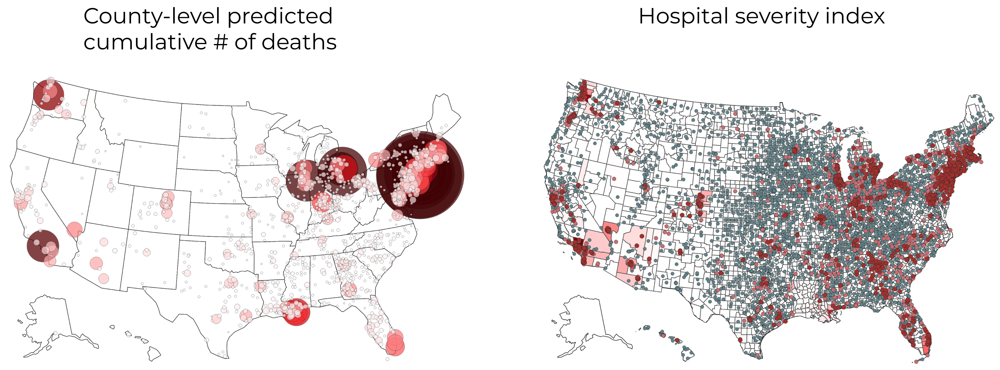

# Overview

[Our group](https://www.stat.berkeley.edu/~yugroup/people.html) at UC Berkeley is working to help forecast the severity of the epidemic both for individual counties and individual hospitals. As a byproduct, we have and will continue to produce models, visualizations, and curated datasets (including confirmed cases/deaths, demographics, risk factors, social distancing data) that can be used by other teams in the fight against COVID-19. We are collaborating with [Response4Life](https://response4life.org/), a non-profit organization, whose goal is to blunt the effect of COVID-19 through the production and appropriate distribution of PPE, medical equipment, and medical personnel to healthcare facilities across the United States. [Paper link](https://www.stat.berkeley.edu/~binyu/ps/papers2020/covid19_paper.pdf): "Curating a COVID-19 data repository and forecasting
county-level death counts in the United States".

- **[Visualizations](http://covidseverity.com/)** (updated daily): see [interactive county-level map](http://covidseverity.com/results/deaths.html) + [interactive hospital-level map](http://covidseverity.com/results/severity_map.html)

- **[Data](./data_new/readme.md)** (updated daily): We have compiled and cleaned a large corpus of hospital- and county-level data from a variety of public sources to aid data science efforts to combat COVID-19.
    - At the hospital level, the data include the location of the hospital, the number of ICU beds, the total number of employees, the hospital type, and contact information
    - At the county level, our data include socioeconomic factors, social distancing scores, and COVID-19 cases/deaths from USA Facts and NYT
- **[Modeling](./modeling/readme.md)**: Using this data, we have developed a short-term (3-5 days) forecasting model for mortality at the county level. This model combines a county-specific exponential growth model and a shared exponential growth model through a weighted average, where the weights depend on past prediction accuracy.
- **Severity index**: The Covid pandemic severity index (CPSI) is designed to help aid the distribution of medical resources to hospitals. It takes on three values (3: High, 2: Medium, 1: Low), indicating the severity of the covid-19 outbreak for a hospital on a certain day. It is calculated in three steps.
    1. county-level predictions for number of deaths are modeled
    2. county-level predictions are allocated to hospitals within counties proportional the their total number of employees
    3. final value is decided by thresholding the number of cumulative predicted deaths for a hospital (=current recorded deaths + predicted future deaths)


# Quickstart with the data + models

## Data
Can load and merge the (abridged) data via:
```python
import load_data
df = load_data.load_county_level(data_dir='/path/to/data')
print(df.shape) 
```

- for more data details, see [./data/readme.md](./data/readme.md)
- see also the [county_quickstart notebook](county_quickstart.ipynb)
- note: abridged csv with county-level info such as demographics, hospital information, risk factors, social distancing, and voting data is saved at `data/county_data_abridged.csv`
- we are constantly monitoring and adding new data sources (+ relevant data news [here](https://docs.google.com/document/d/1Gxfp-8NXHZN1Hre0CThx0sdO17vDOso640eK6MHlbiU/))
- output from running the daily updates is stored [here](./functions/update_test.log)

## Prediction
- To get deaths predictions for our current best-performing model, the simplest way is to call (for more details, see [./modeling/readme.md](./modeling/readme.md))

```python
from modeling.fit_and_predict import add_preds
df = add_preds(df, NUM_DAYS_LIST=[1, 3, 5]) # adds keys like "Predicted Deaths 1-day", "Predicted Deaths 3-day"
# NUM_DAYS_LIST is list of number of days in the future to predict
```

## Related county-level projects
- [County-level data summaries from JHU](https://github.com/JieYingWu/COVID-19_US_County-level_Summaries)
- [UChicago GeoData visualization team](https://geodacenter.github.io/covid/about)


# Acknowledgements

To reference, please cite the paper: [Curating a COVID-19 data repository and forecasting
county-level death counts in the United States](https://www.stat.berkeley.edu/~binyu/ps/papers2020/covid19_paper.pdf) 

The UC Berkeley Departments of Statistics, EECS led by Professor Bin Yu (group members are all alphabetical by last name)

- **[Yu group team](https://www.stat.berkeley.edu/~yugroup/people.html)** (Data/modeling): Nick Altieri, Rebecca Barter, James Duncan, Raaz Dwivedi, Karl Kumbier, Xiao Li, Robbie Netzorg, Briton Park, Chandan Singh (student lead), Yan Shuo Tan, Tiffany Tang, Yu Wang
- [response4Life](https://response4life.org/) team and volunteers (Organization/distribution)
- [Kolak group team](https://geodacenter.github.io/covid/about) (Geospatial visualization): Qinyun Lin
- [Medical team](https://emergency.ucsf.edu/people/aaron-kornblith-md) (Advice from a medical perspective): Roger Chaufournier, Aaron Kornblith, David Jaffe
- [Shen Group team](https://shen.ieor.berkeley.edu/) (IEOR): Junyu Cao, Shunan Jiang, Pelagie Elimbi Moudio
- Helpful input from many including: SriSatish Ambati, Rob Crockett, Tina Elassia-Rad, Marty Elisco, Nick Jewell, Valerie Isham, Valerie Karplus, Andreas Lange, Ying Lu, Samuel Scarpino, Jas Sekhon, Phillip Stark, Jacob Steinhardt, Suzanne Tamang, Brian Yandell, Tarek Zohdi
